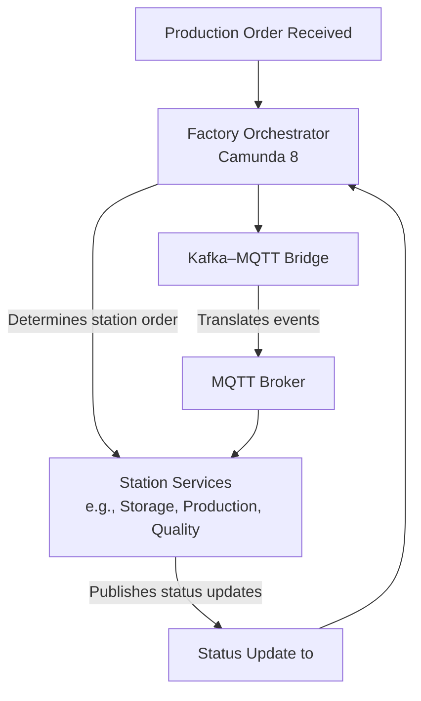

# ADR: Factory Production Workflow Orchestration with MQTT and Camunda 8

## Context

The factory system must process production orders using an event-driven, decoupled architecture. Key requirements include:
- **Dynamic Workflows:** Production orders may follow different station sequences (e.g. storage → production, production → storage, or more complex sequences with quality checks) based on order characteristics.
- **Integration with IoT:** Station controllers and machines communicate using MQTT.
- **Centralized Orchestration:** A dedicated orchestrator is needed to determine the station order, track order progress, and trigger subsequent steps.
- **Scalability and Fault Tolerance:** The system must support high throughput and be resilient under load.

## Decision

We will introduce a workflow orchestrator to manage the dynamic production sequence. Our chosen approach is:

1. **Use Camunda 8 as the Workflow Orchestrator:**  
   Camunda 8 (with its cloud-native Zeebe engine) will manage the dynamic station sequencing for each production order. It will:
    - Determine which stations are involved and in what order.
    - Track the order’s progress.
    - Trigger the next step by publishing events (via our existing Kafka–MQTT Bridge).

2. **Keep the Kafka–MQTT Bridge:**  
   The bridge will continue to translate events from the centralized event stream into MQTT messages. This decouples the transport layer from the orchestration logic.

3. **Decouple Station Logic:**  
   Each station service will be stateless, receiving instructions via MQTT and publishing status updates. The orchestrator is solely responsible for sequencing.

## Alternatives Considered

- **Camunda 7:**  
  *Pros:*
    - Mature and proven BPMN engine with established tooling.  
      *Cons:*
    - Its monolithic architecture is less suited to cloud-native, dynamic workflows compared to Camunda 8.

- **Direct Orchestration Without an External Engine:**  
  (e.g., using a homegrown process manager)  
  *Cons:*
    - Likely to result in tightly coupled logic and reduced flexibility, complicating future scaling and maintenance.

## Consequences

- **Flexibility:** The dynamic workflow orchestrator allows reordering and reconfiguration of station sequences per order without changing individual station services.
- **Decoupling:** The Kafka–MQTT Bridge continues to isolate protocol translation from orchestration.
- **Scalability & Fault Tolerance:** Camunda 8’s modern, cloud-native design supports high throughput and resilience.
- **Complexity:** Introducing an orchestrator adds additional components that require monitoring and configuration.
- **Future Extension:** New stations or workflow changes can be implemented by updating the orchestrator configuration without modifying station services.

## Mermaid Diagram: Service Interaction

Below is a Mermaid diagram that visualizes the interaction between the key components in our factory production workflow:

*Diagram Explanation:*
1. **Production Order Received:** An order is placed and forwarded to the orchestrator.
2. **Factory Orchestrator:** Camunda 8 processes the order, determines the station sequence, and instructs the next station.
3. **Kafka–MQTT Bridge:** The bridge translates orchestrator events into MQTT messages.
4. **Station Services:** Stations (e.g., storage, production) receive instructions via MQTT, perform tasks, and publish status updates.
5. **Status Update to Central Event Bus:** Station updates are sent back to the orchestrator to trigger further workflow steps.

---

This ADR confirms our decision to orchestrate the factory production workflow dynamically using Camunda 8 while retaining the Kafka–MQTT Bridge. Camunda 7 was considered as an alternative but was not chosen due to its less flexible, monolithic architecture compared to the cloud-native benefits of Camunda 8.